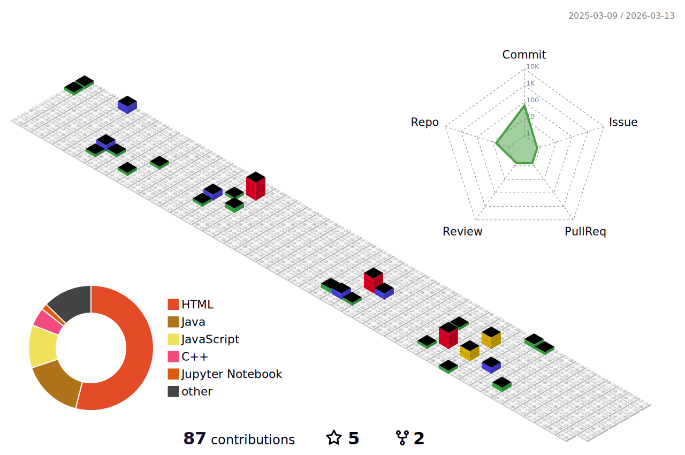

# 👋🏼 Hi, I'm Marc Anthony Aradillas  

Cloud Engineer | Data & Analytics Engineering | Software Developer  
U.S. Air Force Veteran | B.S. Computer Science (Software Engineering)

I'm a technologist with experience in cloud operations (AWS), data engineering pipelines, analytics workflows, and applied machine learning. I enjoy solving complex problems, building clean and reliable systems, and turning raw data into something meaningful.

My background includes:
- Cloud engineering (AWS EC2, S3, RDS, IAM, SSM, automation)
- Data engineering & analytics using Python, SQL, and ETL pipelines
- Machine learning and NLP projects built end-to-end
- Software engineering foundations (OOP, web apps, secure coding, Git)
- Military discipline, leadership, and mission-critical operations

I am actively expanding into **Analytics Engineering** and **Data Engineering**, including Palantir Foundry concepts, modern pipelines, and scalable data systems.

---

## 🔧 Technologies & Tools

### **Languages & Scripting**
Python • SQL • C • C++ • JavaScript • Bash

### **Data / ML**
Pandas • NumPy • Scikit-Learn • NLP (NLTK / spaCy) • Matplotlib • Seaborn

### **Cloud & DevOps**
AWS (EC2, S3, IAM, SSM) • Linux • Git/GitHub • Containers • CI/CD foundations

### **Analytics / Engineering**
ETL Pipelines • Data Modeling • Jupyter • APIs • JSON/XML • Automation

---

## 📌 Featured Projects

### 🔹 **1. GitHub Language Prediction (NLP Project)**
Machine learning model that predicts the primary programming language of GitHub repos using web-scraped text and NLP.
- Python • Pandas • NLP • ML • BeautifulSoup
- Identifies tech stacks using regex + TF-IDF + classification  

➡️ *Useful to show you can build ML + pipelines end-to-end.*

---

### 🔹 **2. Restaurant Inspection Score Prediction (NYC Open Data)**
Forecasts restaurant health inspection results using ML and sentiment extraction from violations.
- EDA, cleaning, NLP, XGBoost  
- Demonstrates strong applied DS + data engineering

---

### 🔹 **3. Tesla Stock Price Prediction (Time Series)**
Full ML workflow predicting monthly TSLA closing prices.
- ARIMA-like pipeline • Visualization • Feature engineering

---

### 🔹 **4. Treasure Hunt Reinforcement Learning Agent**
Solves a grid-based environment using RL concepts.

---

### 🔹 **5. System Analysis & Design (DriverPass Project)**
UML diagrams, system architecture, and process flows.

---

## 🎯 What I'm Learning Now
- Data engineering workflows (ETL, modeling, orchestration)
- Palantir Foundry concepts (Ontologies, Code Workbooks, Pipeline orchestration)
- Advanced Python engineering practices
- Cloud automation + infrastructure concepts

---

## 📫 Connect With Me  
📍 Dallas–Fort Worth  
LinkedIn: https://www.linkedin.com/in/marc-aradillas  
Email: aradillasm@gmail.com  

---

## Profile Activity
      

