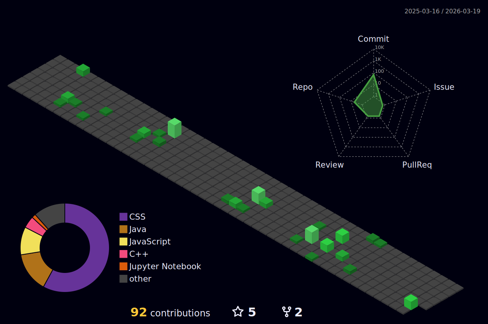

<!--
**Marc-Aradillas/Marc-Aradillas** is a ✨ _special_ ✨ repository because its `README.md` (this file) appears on your GitHub profile.

Here are some ideas to get you started:

- 🔭 I’m currently working on ...
- 🌱 I’m currently learning ...
- 👯 I’m looking to collaborate on ...
- 🤔 I’m looking for help with ...
- 💬 Ask me about ...
- 📫 How to reach me: ...
- 😄 Pronouns: ...
- ⚡ Fun fact: ...
-->

# Hi, My name is Marc Anthony Aradillas 👋🏼     

## About Me🧑🏼‍💻

<table>

I am interested in Data science and to me it's like a treasure hunt, where I get to uncover valuable insights hidden within vast oceans of data. It empowers me to extract meaning from complex information, unveil patterns, and make predictions that can shape the future. 🗺️💡

From predicting customer behavior to optimizing business strategies, data science offers incredible opportunities for transformative discoveries and informed decision-making. Its interdisciplinary nature, blending mathematics, statistics, programming, and domain expertise, truly fascinates me. 🌐🔍

That's precisely why I've chosen Codeup as the launchpad for my data science expedition! 

<picture>
    <source media="(prefers-color-scheme: dark)" srcset="https://blog.codeup.com/hs-fs/hubfs/OfficialCodeupLogoSmall.png?width=500&name=OfficialCodeupLogoSmall.png">
     <source media="https://blog.codeup.com/hs-fs/hubfs/OfficialCodeupLogoSmall.png?width=500&name=OfficialCodeupLogoSmall.png">
     
  </picture>

Codeup is a renowned institution that provides an immersive and rigorous curriculum, equipping me with the technical skills and practical experience needed to thrive in the data-driven world. 🚀💻

During my studies at Codeup, I will be diving deep into the realm of data science, mastering the fundamentals of statistical analysis, machine learning, and data visualization. I'll learn to wield powerful programming languages such as Python and R, gaining the ability to manipulate and transform data to unveil its underlying stories. 📊🔬

Not only will I gain expertise in building predictive models and designing experiments, but I'll also develop the critical thinking and problem-solving mindset necessary to tackle real-world challenges head-on. I'll collaborate with a vibrant community of fellow learners, engage in stimulating projects, and continuously refine my skills through hands-on experiences. 💪🌱

Through my data science journey at Codeup, I aim to become a trusted ally to individuals, organizations, and researchers seeking data-driven insights. I want to make a tangible impact by leveraging the power of data and machine learning to drive innovation, solve problems, and contribute to the greater good. 🌍✨

I am excited to continue on this thrilling adventure! where i will learn to unlock the vast potential of data science and shape a smarter, more data-driven future with my cohorts. 🎢🌌

  </table>

<table>
  <tr>
    <td valign="center">
      
🎓 I am currently pursuing my **Bachelor's in Computer Science with a concentration in Software Engineering at Southern New Hampshire University Online and partaking in a Cohort in a Data Science Program at Code Up LLC.

🌱 I am currently learning **Data Science/Python/C++/Java/HTML/CSS** and also interested in **Machine Learning/Data Science/Artificial Intelligence/Computer Vision**.

🎯 My Goal is to Contribute to as many **open source project** as possible, but mostly focus on my personal projects.

✨ I like to dive into the latest trending Tech topics and become well versed and informed on emerging technologies.
 
## Connect With Me👋🏼

  

    
## Technologies⚙️

### Languages✍🏼

  
 
  

### Machine Learning Frameworks APIs

 

### DevOps & Cloud Tools⚒️

## My Experiences🙌🏼

Class Projects found in my Respositories

## Profile Activity 👾
      

