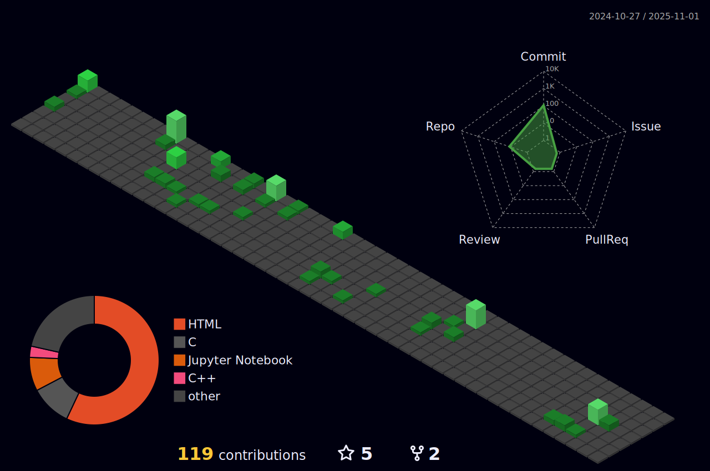

<!--
**Marc-Aradillas/Marc-Aradillas** is a ✨ _special_ ✨ repository because its `README.md` (this file) appears on your GitHub profile.

Here are some ideas to get you started:

- 🔭 I’m currently working on ...
- 🌱 I’m currently learning ...
- 👯 I’m looking to collaborate on ...
- 🤔 I’m looking for help with ...
- 💬 Ask me about ...
- 📫 How to reach me: ...
- 😄 Pronouns: ...
- ⚡ Fun fact: ...
-->

# Hi, My name is Marc Anthony Aradillas 👋🏼    

## About Me🧑🏼‍💻

I'm passionate about data science, and I'm on a journey to uncover insights hidden within data. My background spans data analysis and programming. I'm currently enhancing my skills in the data science/analytics domain and looking to also explore web development. 

🎓 I'm pursuing a Bachelor's in Computer Science with a concentration in Software Engineering at Southern New Hampshire University.

🌱 I'm learning secure coding with C++ and full stack development currently using the MEAN (MongoDB, Express.js, Angular, and Node.js) stack.

✨ My goal is to contribute to open source projects and work on personal projects that align with my interests.
 
## Connect With Me👋🏼

  

<!--  -->

## Technologies⚙️

### Languages✍🏼

  
 
  

### Machine Learning Frameworks APIs

### DevOps & Cloud Tools⚒️

 

## My Experiences🙌🏼 (All Academic)

- Clustering Analyis implementing Logistic Regression Modeling to identify variables that drive wine quality
- Anomaly Detection using Probalistic Methods with Matplotlib visualization to display anomoulos activity looking at Codeups access log to their website/curriculums
- Individual Project That aims to Predict The Monthly Closing price for Tesla Company Stock (Data Science Pipeline work on a Volatile Stock)

## Profile Activity 👾
      

